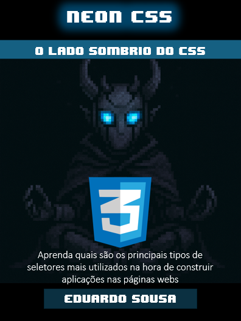

    

-------

# Projeto EBOOK Gerado por I.A.s

 > ℹ️ **NOTE:**  Este projeto é um desafio da DIO referente ao bootcamp "Universia - Fundamentos de IA Generativa". Para mais informações basta acessar este link "https://github.com/felipeAguiarCode/prompts-recipe-to-create-a-ebook".

Projeto com o objetivo de gerar um ebook digital com as facilidades das ferramentas de IA. todos os prompts
seguem abaixo.

<a href="" title="View PDF now"> 📕Clique aqui para ler</a>

## 💻 Tecnologias utilizadas no projeto

- [ChatGPT](https://chat.openai.com/) 
- [PowerPoint](https://www.microsoft.com/en/microsoft-365/powerpoint)

## 🧠 Prompts

ChatGPT：

|   Ação   | prompt                                                                                                                                                                                                                                                                         |
| :------: | ------------------------------------------------------------------------------------------------------------------------------------------------------------------------------------------------------------------------------------------------------------------------------ |
|  título  | Crie um título de um ebook sobre o tema de css, o ebookk é do nicho de programação e o subnicho é de css, o título deve ser épico e curto, e tenha uma temática de star wars no título, me liste 5 variações de títulos                                                        |
| conteúdo | Faça um texto para ebook , com foco em CSS, listando os principais seletores CSS com exemplos em código {REGRAS} Explique sempre de uma maneira simples Deixe o texto enxuto, Sempre traga exemplos de código em contextos reais , sempre deixe um título sugestivo por tópico |

ChatGPT：

|  Ação  | prompt                                                                                 |
| :----: | -------------------------------------------------------------------------------------- |
| título | a robot in meditation pose, with with your bionic blue ayes, pixel art style |

## ✨ Features

- Conteúdo gerado via ChatGPT
- Imagens geradas via ChatGpt (A proposta inicial do projeto era que fosse usado o MidJourney, mas como não consegui utilizá-lo, gerei a imagens com o ChatGPT)

## 📚 Materiais

- Imagens utilizadas em `assets`
- ebook gerado durante as aulas em `output`

## 🛠️ Instruções de execução

Utilize os prompts acima nas ferramentas sugeridas para gerar o material base e utilize uma ferramenta de edição de documentos como power point, libreoffice , indesign para diagramação.

## 👨‍💻 Expert

    
    
&nbsp&nbsp&nbspFelipe Aguiar 
    &nbsp&nbsp&nbsp
    <a href="https://github.com/eduares">
    GitHub</a>&nbsp;|&nbsp;
    <a href="https://www.linkedin.com/in/eduardo-s-150567156/">LinkedIn</a>
&nbsp;|&nbsp;

  

---

⌨️ com 💜 por [Eduardo Sousa](https://github.com/eduares)